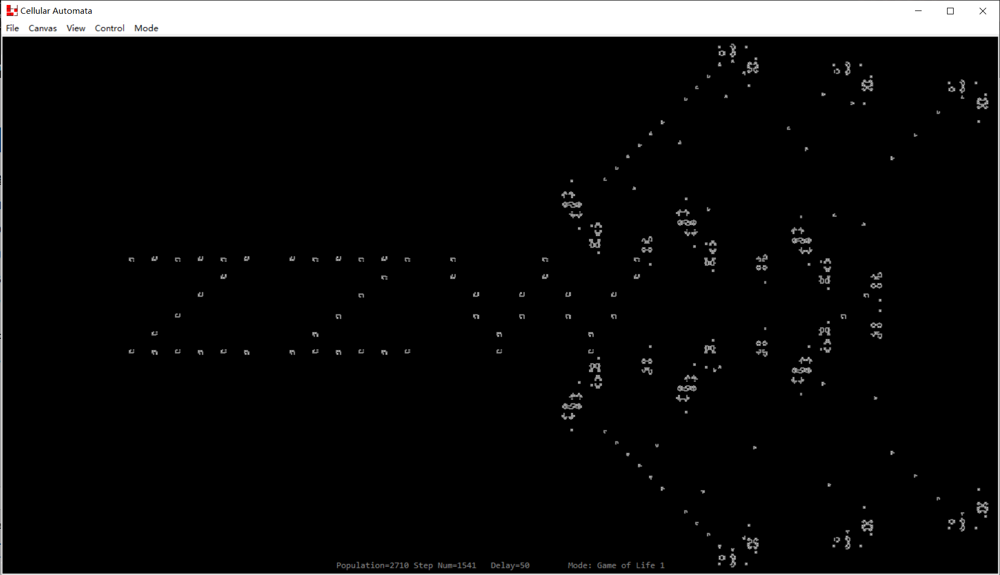
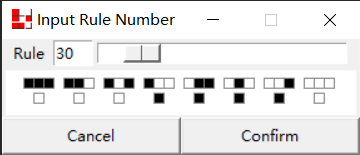
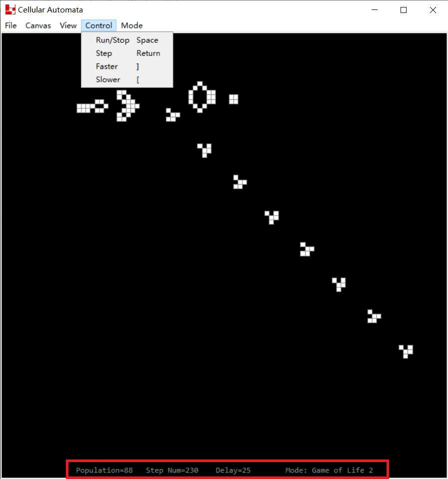

# Cellular Automata

## Command Line Tool

Mainly for testing runtime of the algorithm, without the disturbance of GUI packages and settings.

- Normal

  Uses algorithm the same as the one used in GUI version. Compatiable to all patterns but can be relatively slow.

- Hashlife

  Use quad tree to divide the canvas and has map to store existing patterns. Fast but require large memory especially for larger patterns.

To run, execute:

```shell
$ python3 normal.py
```

or

```shell
$ python3 hashlife.py
```

Then input .cellauto files and the number of steps for the simulation, or type QUIT to stop:

```shell
Input the filename or type "QUIT" to stop:
Patterns/breeder.cellauto
Input number of steps
100000
```

The program will then output the runtime for the simulation.

## GUI

GUI tools for cellular automata.



To run, execute

```shell
$ python3 __main__.py
```

Current version supports following functionalities:

- Mode Selection

  Click Menubar -> Mode to select modes. Click "Customize Rule" and select an number within range [0, 255] to customize the rule for Sierpinski triangle.

  

- Sizing

  Canvas can be resized through Menubar -> Canvas -> Set Unit Number.

  The view of the canvas can be zoom in or zoom out by mouse wheel.

- Graphing

  Create new cells by left clicking and delete by right clicking.

  Drawing a line of cells through continues left clicking.

  Randomly generate the pattern through Menubar -> Canvas -> Random.

  Clear the canvas by Menubar -> Canvas -> Clear or shortcut Ctrl + Tab.

- Simulation

  Run one step of simulation by typing Return.

  Run continuous simulation by typing Whitespace. Type again to stop.

  Increase simulation speed (reduce time between every 2 steps) by typing "]".

  Decrease simulation speed (increase time between every 2 steps) by typing "[".

  Operations above can also be found at Menubar -> Control.

  Click Menubar -> Canvas -> Turn Back to return to the inital pattern before the simulation started.

  Current simulation status/info can be found at the lower side of the window, including cell population, step number since the start of simulation, time interval between every 2 steps, and the simulation mode.

  

- File Saving and Reading

  Open a .cellauto file by clicking Menubar -> File -> Open or shortcut Ctrl + O

  Save intial canvas before the simulation by clicking Menubar -> File -> Save Initial or shortcut Ctrl + S.

  Save current canvas by clicking Menubar -> File -> Save Current or shortcut Ctrl + Shift + S